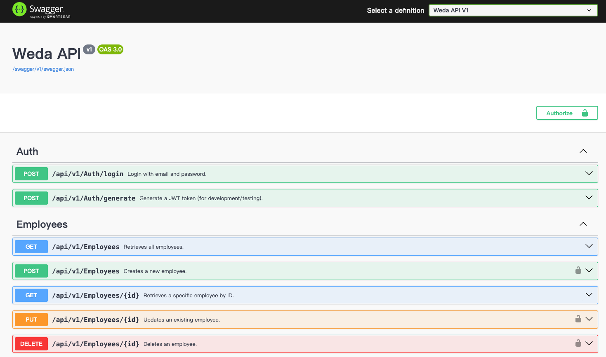
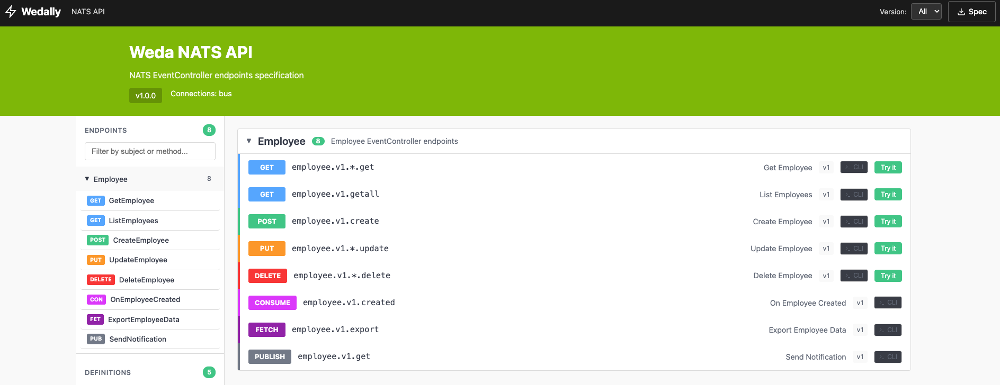
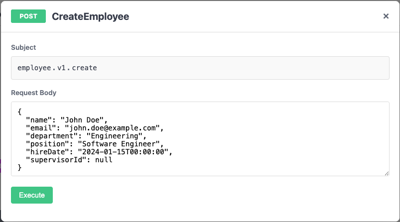
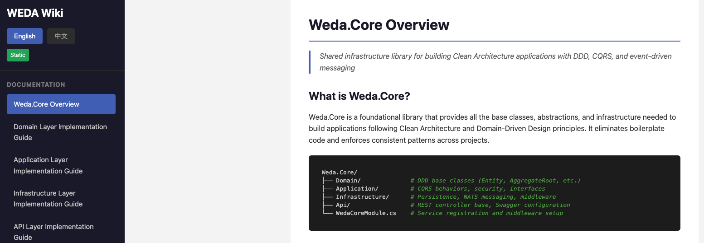

# WEDA Template

[中文版](README_zh.md)

A production-ready Clean Architecture template for .NET 10 applications, featuring Domain-Driven Design (DDD), CQRS pattern, and comprehensive testing practices.

## Features

- **Clean Architecture** - Layered architecture with clear separation of concerns
- **Domain-Driven Design** - Entities, Value Objects, Aggregate Roots, Domain Events
- **CQRS Pattern** - Command Query Responsibility Segregation with Mediator
- **Multiple Database Support** - SQLite, PostgreSQL, MongoDB
- **JWT Authentication** - Role-based and permission-based authorization
- **NATS Messaging** - Event-driven architecture with request-reply and pub-sub patterns
- **API Versioning** - Built-in API versioning support
- **Swagger/OpenAPI** - Auto-generated API documentation
- **Comprehensive Testing** - Unit, integration, and subcutaneous tests

## Preview

### Developer UI
+ Developer-friendly UI including Swagger UI, Wedally UI, and Wiki


### Pre-configured Swagger UI
+ Pre-configured Swagger UI with Grouping, Tags, and SecurityRequirement settings


### NATS Endpoint UI (Wedally UI)
+ Swagger-like UI for NATS endpoints with direct interaction support and copy-paste ready payloads

+ Direct operation support


### Auto-generated Wiki Pages
+ Automatically converts articles from `docs/wiki/{en,zh}` to static web pages
+ Supports markdown rendering


## Project Structure

```
WedaTemplate/
├── src/
│   ├── Weda.Core/                    # Shared infrastructure (DDD, CQRS, NATS)
│   ├── Weda.Template.Api/            # REST API layer
│   ├── Weda.Template.Application/    # Application/CQRS layer
│   ├── Weda.Template.Contracts/      # DTOs and contracts
│   ├── Weda.Template.Domain/         # Domain layer
│   └── Weda.Template.Infrastructure/ # Infrastructure layer
├── tests/
│   ├── Weda.Template.Api.IntegrationTests/
│   ├── Weda.Template.Application.UnitTests/
│   ├── Weda.Template.Domain.UnitTests/
│   ├── Weda.Template.Infrastructure.UnitTests/
│   └── Weda.Template.TestCommon/
└── tools/
    └── WikiGenerator/
```

## Getting Started

### Prerequisites

- [.NET 10 SDK](https://dotnet.microsoft.com/download)
- Docker & Docker Compose (optional)
- NATS Server (optional, for messaging features)

### Run with .NET CLI

```bash
dotnet run --project src/Weda.Template.Api
```

### Run with Docker Compose

```bash
docker compose up
```

The API will be available at `http://localhost:5001`

### Access Swagger UI

Navigate to `http://localhost:5001/swagger` to explore the API documentation.

## Domain Models

### Employee

- Hierarchical organization structure with supervisor relationships
- Department management (Engineering, HR, Finance, Marketing, Sales, Operations)
- Status tracking (Active, OnLeave, Inactive)
- Subordinate management with circular reference prevention

### User

- Email-based authentication
- Role management (User, Admin, SuperAdmin)
- Permission-based access control
- Login tracking

## API Endpoints

### Auth

| Method | Endpoint | Description |
|--------|----------|-------------|
| POST | `/api/v1/auth/login` | User login |

### Users

| Method | Endpoint | Role | Description |
|--------|----------|------|-------------|
| GET | `/api/v1/users/me` | Authenticated | Get current user |
| GET | `/api/v1/users` | Admin | List all users |
| GET | `/api/v1/users/{id}` | Admin | Get user by ID |
| POST | `/api/v1/users` | Admin | Create user |
| PUT | `/api/v1/users/{id}` | Admin | Update user |
| PUT | `/api/v1/users/{id}/roles` | SuperAdmin | Update roles |
| DELETE | `/api/v1/users/{id}` | Admin | Delete user |

### Employees

| Method | Endpoint | Description |
|--------|----------|-------------|
| GET | `/api/v1/employees` | List all employees |
| GET | `/api/v1/employees/{id}` | Get employee by ID |
| POST | `/api/v1/employees` | Create employee |
| PUT | `/api/v1/employees/{id}` | Update employee |
| DELETE | `/api/v1/employees/{id}` | Delete employee |
| GET | `/api/v1/employees/{id}/subordinates` | Get subordinates |

## NATS Integration

### EventController - ApiController-like Experience for NATS

The template provides `EventController`, an abstraction similar to ASP.NET Core's `ApiController` but for NATS messaging. This allows you to handle NATS messages with familiar patterns.

```csharp
[ApiVersion("1")]
public class EmployeeEventController : EventController
{
    // Request-Reply pattern with subject-based routing
    [Subject("[controller].v{version:apiVersion}.{id}.get")]
    public async Task<GetEmployeeResponse> GetEmployee(int id)
    {
        var query = new GetEmployeeQuery(id);
        var result = await Mediator.Send(query);
        return new GetEmployeeResponse(result.Value);
    }

    // Create employee
    [Subject("[controller].v{version:apiVersion}.create")]
    public async Task<GetEmployeeResponse> CreateEmployee(CreateEmployeeRequest request)
    {
        var command = new CreateEmployeeCommand(request.Name, request.Email, ...);
        var result = await Mediator.Send(command);
        return new GetEmployeeResponse(result.Value);
    }

    // JetStream Consume pattern (fire-and-forget)
    [Subject("[controller].v{version:apiVersion}.created")]
    public async Task OnEmployeeCreated(CreateEmployeeNatsEvent @event)
    {
        var command = new CreateEmployeeCommand(@event.Name, @event.Email, ...);
        await Mediator.Send(command);
    }
}
```

### Supported NATS Patterns

| Pattern | Description | Use Case |
|---------|-------------|----------|
| **Request-Reply** | Synchronous request with response | CRUD operations |
| **JetStream Consume** | Continuous message processing | Event handlers |
| **JetStream Fetch** | Batch message processing | Bulk operations |
| **Core Pub-Sub** | Fire-and-forget messaging | Notifications |

### NATS Endpoints

| Subject | Description |
|---------|-------------|
| `employee.v1.{id}.get` | Get employee by ID |
| `employee.v1.getAll` | List all employees |
| `employee.v1.create` | Create employee |
| `employee.v1.{id}.update` | Update employee |
| `employee.v1.{id}.delete` | Delete employee |

### NATS CLI Examples

Copy and paste these commands to interact with the NATS endpoints directly:

**Get Employee by ID:**
```bash
nats req employee.v1.1.get ''
```

**List All Employees:**
```bash
nats req employee.v1.getAll ''
```

**Create Employee:**
```bash
nats req employee.v1.create '{"name":"John Doe","email":"john@example.com","department":"Engineering","position":"Software Engineer"}'
```

**Update Employee:**
```bash
nats req employee.v1.1.update '{"name":"John Doe","email":"john.doe@example.com","department":"Engineering","position":"Senior Engineer","status":"Active"}'
```

**Delete Employee:**
```bash
nats req employee.v1.1.delete ''
```

## Configuration

### Database

```json
{
  "Database": {
    "Provider": "Sqlite",
    "ConnectionString": "Data Source=Weda.Template.sqlite"
  }
}
```

Supported providers: `Sqlite`, `PostgreSQL`, `MongoDB`

### JWT Settings

```json
{
  "JwtSettings": {
    "Secret": "your-secret-key-at-least-32-characters",
    "TokenExpirationInMinutes": 60,
    "Issuer": "WedaTemplate",
    "Audience": "WedaTemplate"
  }
}
```

### NATS Messaging

```json
{
  "Nats": {
    "Url": "nats://localhost:4222",
    "Name": "weda-template"
  }
}
```

### Email Notifications

```json
{
  "EmailSettings": {
    "EnableEmailNotifications": false,
    "DefaultFromEmail": "your-email@example.com",
    "SmtpSettings": {
      "Server": "smtp.gmail.com",
      "Port": 587,
      "Username": "your-email@gmail.com",
      "Password": "your-password"
    }
  }
}
```

## Authorization

The template supports three types of authorization:

### Role-Based Authorization

```csharp
[Authorize(Roles = "Admin")]
public record GetUserQuery(Guid Id) : IAuthorizeableRequest<ErrorOr<User>>;
```

### Permission-Based Authorization

```csharp
[Authorize(Permissions = "users:read")]
public record ListUsersQuery : IAuthorizeableRequest<ErrorOr<List<User>>>;
```

### Policy-Based Authorization

```csharp
[Authorize(Policies = "SelfOrAdmin")]
public record UpdateUserCommand(Guid Id, ...) : IAuthorizeableRequest<ErrorOr<User>>;
```

## Testing

```bash
# Run all tests
dotnet test

# Run with coverage
dotnet test --collect:"XPlat Code Coverage"
```

### Test Types

- **Domain Unit Tests** - Test domain entities and value objects
- **Application Unit Tests** - Test handlers and pipeline behaviors
- **Infrastructure Unit Tests** - Test repositories and persistence
- **Integration Tests** - End-to-end API testing

## Architecture Patterns

| Pattern | Implementation |
|---------|----------------|
| Domain-Driven Design | Entity, AggregateRoot, Value Objects, Domain Events |
| CQRS | Mediator-based command/query separation |
| Repository Pattern | Generic and specialized repositories |
| Pipeline Behaviors | Validation and authorization cross-cutting |
| Eventual Consistency | Middleware-based domain event publishing |
| Event-Driven | NATS messaging for async communication |

## License

This project is licensed under the MIT License.